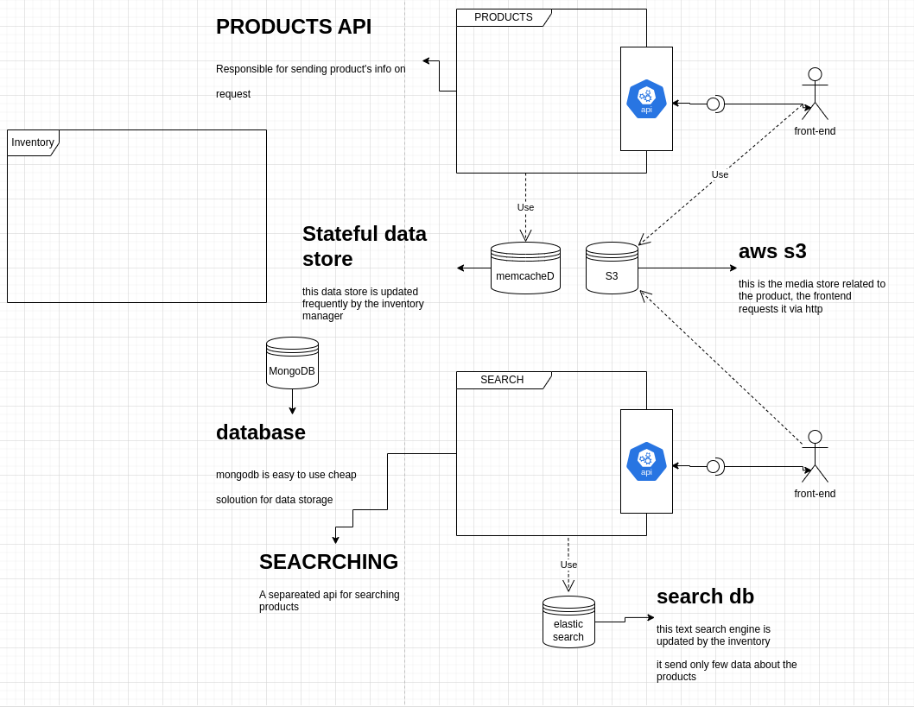

# high level design, 1.0

## FIRST: components:

### **INVENTORY MANGER**

- **Functionalities**

  - Create/Update/Delete products
  - provide in time updates for the inventory status

- **other info**
  - has a mongodb DB for products info storage

### **USERS MANAGERS**

- OBVIOUS

### **API FOR RETRIEVING PRODUCTS**
